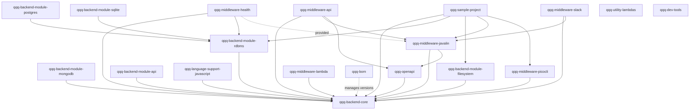

# Architecture

**Analysis Date:** 2026-04-22

## Pattern Overview

**Overall:** Metadata-driven application framework, delivered as a **multi-module library suite** (not a runtime platform / not a standalone application). Consuming applications embed `qqq-backend-core` plus a choice of backend modules, middleware modules, and optional extensions.

QQQ is simultaneously:
- A **framework** — a consuming application defines metadata (tables, processes, fields, etc.) and QQQ's action pipeline drives all CRUD + process execution against that metadata.
- A **library** — concrete actions (`QueryAction`, `InsertAction`, `RunProcessAction`, `ExportAction`, …) can be called directly as Java APIs.
- A **platform assembly kit** — middleware modules provide pluggable surfaces (HTTP via Javalin, CLI via PicoCLI, AWS Lambda, Slack, health probes) that expose the same metadata-defined app through different channels with no duplication of business logic.

**Key Characteristics:**
- **Metadata-first:** the central `QInstance` (`qqq-backend-core/src/main/java/com/kingsrook/qqq/backend/core/model/metadata/QInstance.java`) aggregates `QTableMetaData`, `QProcessMetaData`, `QBackendMetaData`, `QAuthenticationMetaData`, `QJoinMetaData`, apps, reports, widgets, security locks, etc. Almost every subsystem consumes metadata rather than hard-coded logic.
- **SPI / dispatcher pattern:** backend storage, authentication, scheduling, and messaging are all SPIs (`QBackendModuleInterface`, `QAuthenticationModuleInterface`, `QSchedulerInterface`, `QMessagingProviderModuleInterface`) resolved at runtime via dispatcher classes (`QBackendModuleDispatcher`, `QAuthenticationModuleDispatcher`).
- **Uniform action pipeline:** every CRUD / read / report / process operation flows through an input/output model + action class pair (`QueryInput`/`QueryOutput` + `QueryAction`, etc.), making all middleware adapters structurally similar.
- **Thread-local context:** `QContext` (`qqq-backend-core/src/main/java/com/kingsrook/qqq/backend/core/context/QContext.java`) holds the active `QInstance`, `QSession`, `QBackendTransaction`, and action stack in thread-locals — middleware code is expected to call `QContext.init(...)` on entry and `QContext.clear()` on exit.
- **No Spring / no CDI:** no DI container; wiring is explicit via metadata producers and `QCodeReference` indirection (`qqq-backend-core/src/main/java/com/kingsrook/qqq/backend/core/model/metadata/code/QCodeReference.java`) which loads classes reflectively at runtime.
- **GPL-like licensing:** AGPL-3.0 (see `LICENSE` and the license header baked into every Java source file — this is enforced by the checkstyle `headerLocation` rule in `pom.xml`).

## Layers

### 1. Metadata Model (declarative layer)
- **Purpose:** Pure POJOs describing the application: tables, fields, joins, processes, backends, auth, apps, widgets, reports, permissions, security locks.
- **Location:** `qqq-backend-core/src/main/java/com/kingsrook/qqq/backend/core/model/metadata/`
- **Contains:** `QInstance` (root), `QTableMetaData`, `QFieldMetaData`, `QBackendMetaData`, `QProcessMetaData`, `QJoinMetaData`, `QAppMetaData`, `QAuthenticationMetaData`, `MetaDataProducerInterface`, plus subpackages: `tables/`, `fields/`, `processes/`, `joins/`, `authentication/`, `security/`, `qbits/`, `frontend/`, `reporting/`, `scheduleing/`, `variants/`, `sharing/`, `permissions/`, `messaging/`.
- **Depends on:** nothing (pure data classes).
- **Used by:** every other layer.

### 2. Action I/O Model (request/response layer)
- **Purpose:** Typed input/output DTOs for every action.
- **Location:** `qqq-backend-core/src/main/java/com/kingsrook/qqq/backend/core/model/actions/`
- **Contains:** `AbstractActionInput`, `AbstractActionOutput`, `AbstractTableActionInput`, and per-operation pairs under `tables/` (query, get, insert, update, delete, count, aggregate), `processes/` (`RunProcessInput`/`RunProcessOutput`, `ProcessState`), `reporting/`, `metadata/`, `scripts/`, `audits/`, `messaging/`, `widgets/`, `templates/`, `values/`, `shared/`.
- **Depends on:** metadata model, `QRecord`.
- **Used by:** actions layer, middleware layer.

### 3. Record Model (data layer)
- **Purpose:** Unified data container independent of storage backend.
- **Location:** `qqq-backend-core/src/main/java/com/kingsrook/qqq/backend/core/model/data/`
- **Contains:** `QRecord` (map-based row abstraction), `QRecordEntity` (POJO-bound superclass), `QField` / `QAssociation` annotations, `QRecordEnum`, `QVirtualField`.
- **Depends on:** metadata model.
- **Used by:** every read/write path, adapters, export/import.

### 4. Actions (business-logic layer)
- **Purpose:** Concrete operations that read/transform metadata + record state.
- **Location:** `qqq-backend-core/src/main/java/com/kingsrook/qqq/backend/core/actions/`
- **Contains:**
  - `tables/` — `QueryAction`, `GetAction`, `InsertAction`, `UpdateAction`, `DeleteAction`, `CountAction`, `AggregateAction`, `ReplaceAction`, `StorageAction` (plus `helpers/` for caching, unique-key enforcement, record security).
  - `processes/` — `RunProcessAction`, `RunBackendStepAction`, `CancelProcessAction`, `BackendStep`, `QProcessCallback`.
  - `reporting/` — `GenerateReportAction`, `ExportAction`, CSV/TSV/JSON/Excel streamers, `RecordPipe`.
  - `automation/` — trigger handlers, polling automation.
  - `interfaces/` — SPI for backend modules: `QueryInterface`, `GetInterface`, `InsertInterface`, `UpdateInterface`, `DeleteInterface`, `CountInterface`, `AggregateInterface`, `QStorageInterface`.
  - `async/` — `AsyncJobManager`, `AsyncJobCallback`, `JobGoingAsyncException` (pattern for long-running ops to go async and return a handle).
  - `customizers/` — pre/post-insert/update/delete/query customizer hooks loaded via `QCodeReference`.
  - `audits/`, `permissions/`, `metadata/`, `dashboard/`, `scripts/`, `queues/`, `templates/`, `messaging/`, `values/`.
- **Depends on:** metadata model, action I/O model, record model, backend-module SPI.
- **Used by:** middleware, user code.

### 5. Backend Module SPI + in-core Implementations
- **Purpose:** Pluggable persistence. Each backend type is a class implementing `QBackendModuleInterface` that returns specialized `*Interface` implementations.
- **Location:** `qqq-backend-core/src/main/java/com/kingsrook/qqq/backend/core/modules/backend/`
- **Core SPI:** `QBackendModuleInterface` (`.../modules/backend/QBackendModuleInterface.java`), `QBackendModuleDispatcher` (`.../modules/backend/QBackendModuleDispatcher.java`) — backends register themselves at runtime via `registerBackendModule(...)`.
- **In-core implementations (`.../modules/backend/implementations/`):**
  - `memory/MemoryBackendModule.java` — in-memory store (used widely in tests)
  - `enumeration/EnumerationBackendModule.java` — read-only, enum-backed
  - `mock/MockBackendModule.java` — test doubles
- **External implementations:** see module list under **Modules** below.

### 6. Authentication Module SPI + Implementations
- **Purpose:** Pluggable session establishment & validation.
- **Location:** `qqq-backend-core/src/main/java/com/kingsrook/qqq/backend/core/modules/authentication/`
- **SPI:** `QAuthenticationModuleInterface`, `QAuthenticationModuleDispatcher`, `QAuthenticationModuleCustomizerInterface`, `QSessionStoreProviderInterface`, `QSessionStoreRegistry`.
- **Implementations (`.../implementations/`):** `Auth0AuthenticationModule`, `OAuth2AuthenticationModule`, `TableBasedAuthenticationModule`, `MockAuthenticationModule`, `FullyAnonymousAuthenticationModule`.

### 7. Instance Lifecycle (bootstrap layer)
- **Purpose:** Construct, enrich, and validate a `QInstance` before it goes live.
- **Location:** `qqq-backend-core/src/main/java/com/kingsrook/qqq/backend/core/instances/`
- **Contains:**
  - `AbstractQQQApplication.java`, `MetaDataProducerBasedQQQApplication.java`, `AbstractMetaDataProducerBasedQQQApplication.java`, `ConfigFilesBasedQQQApplication.java` — application-bootstrap abstractions a consuming app extends to produce its `QInstance`.
  - `QInstanceEnricher.java` — fills in inferred/defaulted metadata (labels, join inferences, etc.).
  - `QInstanceValidator.java` + `validation/` — multi-pass validator that must pass before an instance is usable.
  - `loaders/` — `AbstractMetaDataLoader`, `MetaDataLoaderHelper`, `MetaDataLoaderRegistry` — config-file-driven metadata loading.
  - `assessment/`, `enrichment/`, `QMetaDataVariableInterpreter.java` — `${env.NAME}`-style interpolation of env vars / secrets.
- **Used by:** every entry point — middleware and app code must build and validate a `QInstance` before using any action.

### 8. Context & Session
- **Purpose:** Per-thread state.
- **Location:** `qqq-backend-core/src/main/java/com/kingsrook/qqq/backend/core/context/QContext.java` and `qqq-backend-core/src/main/java/com/kingsrook/qqq/backend/core/model/session/`
- **Contains:** `QContext` (thread-locals for `QInstance`, `QSession`, `QBackendTransaction`, action stack, request-scoped objects map). `QSession` is the authenticated user + permissions + security-key values.

### 9. Scheduler
- **Purpose:** Cron/interval scheduled jobs (metadata-driven).
- **Location:** `qqq-backend-core/src/main/java/com/kingsrook/qqq/backend/core/scheduler/`
- **SPI:** `QSchedulerInterface`, `QScheduleManager`. Two implementations: `simple/` (in-process) and `quartz/` (Quartz-based). `schedulable/` provides the schedulable-unit abstraction.

### 10. Adapters & Serialization
- **Purpose:** Convert between `QRecord`/`QInstance` and external formats.
- **Location:** `qqq-backend-core/src/main/java/com/kingsrook/qqq/backend/core/adapters/`
- **Contains:** `CsvToQRecordAdapter`, `JsonToQRecordAdapter`, `JsonToQFieldMappingAdapter`, `QRecordToCsvAdapter`, `QRecordToTsvAdapter`, `QInstanceAdapter`, `QQueryFilterJsonAdapter`.

### 11. Middleware (transport / frontend layer)
- **Purpose:** Expose the same `QInstance` through different channels.
- **Location:** `qqq-middleware-*/src/main/java/...`
- **Modules:** javalin (HTTP), api (versioned REST API spec), lambda (AWS), picocli (CLI), slack (bot), health (Kubernetes probes). Each one knows how to accept a protocol-specific request, convert it to action I/O, call the core action, and serialize the response.

## Modules (distribution units)

| Module | Role | Depends on (compile) | Shipped as |
|---|---|---|---|
| `qqq-bom` | Bill-of-materials POM aligning versions | — | POM only |
| `qqq-backend-core` | Framework core | — (leaf) | JAR |
| `qqq-backend-module-rdbms` | JDBC-backed RDBMS (MySQL, Aurora, H2 test) | `qqq-backend-core` | JAR |
| `qqq-backend-module-postgres` | Postgres specialization | `qqq-backend-module-rdbms` | JAR |
| `qqq-backend-module-sqlite` | SQLite specialization | `qqq-backend-module-rdbms` | JAR |
| `qqq-backend-module-mongodb` | MongoDB | `qqq-backend-core` | JAR |
| `qqq-backend-module-api` | Treat a remote HTTP API as a backend | `qqq-backend-core` | JAR |
| `qqq-backend-module-filesystem` | Local FS / S3 / SFTP as a backend | `qqq-backend-core` | JAR |
| `qqq-language-support-javascript` | Run JS (Nashorn/GraalJS) snippets as QQQ code references | `qqq-backend-core` | JAR |
| `qqq-openapi` | OpenAPI model POJOs | `qqq-backend-core` | JAR |
| `qqq-middleware-javalin` | Javalin HTTP server + frontend route providers | `qqq-backend-core`, `qqq-openapi` | JAR (+ tests classifier) |
| `qqq-middleware-api` | Versioned REST API (public-facing) | `qqq-backend-core`, `qqq-middleware-javalin`, `qqq-openapi` | JAR |
| `qqq-middleware-health` | Health-check `/healthz` endpoint set | `qqq-backend-core`, `qqq-backend-module-rdbms`, `qqq-middleware-javalin` (provided) | JAR |
| `qqq-middleware-picocli` | CLI frontend | `qqq-backend-core` | JAR |
| `qqq-middleware-lambda` | AWS Lambda handler (optionally shaded) | `qqq-backend-core` | JAR / shaded JAR |
| `qqq-middleware-slack` | Slack slash-command frontend | `qqq-backend-core`, `qqq-middleware-javalin` | JAR |
| `qqq-utility-lambdas` | Standalone AWS Lambda utilities (e.g., SQS fan-out) | `qqq-backend-core` indirectly | shaded JAR |
| `qqq-sample-project` | Reference implementation | core + rdbms + filesystem + javalin + picocli + frontend-material-dashboard | not published |
| `qqq-dev-tools` | Maintainer tooling (shell scripts, QBit generator) | — | not published |

All modules share `com.kingsrook.qqq` as the groupId and `qqq-parent-project` as the Maven parent. The revision is `${revision}` resolved via `flatten-maven-plugin` (`resolveCiFriendliesOnly`); current version is `0.42.0-SNAPSHOT`. Target JVM is **Java 21** (`maven.compiler.release=21`).

## Module Dependency Graph

**Inferred rules:**
- `qqq-backend-core` is a pure leaf (no QQQ deps).
- Every other production module depends transitively on `qqq-backend-core`.
- `qqq-backend-module-rdbms` is the base for the two RDBMS specializations (postgres, sqlite).
- `qqq-middleware-javalin` is the backbone for HTTP-exposed middleware (`middleware-api`, `middleware-health`, `middleware-slack`).
- `qqq-bom` declares versions for core + rdbms + mongodb + api + filesystem + middleware-{javalin, slack, api, picocli} + openapi + language-support-javascript so downstream apps can import a single BOM.
- `qqq-dev-tools` and `qqq-utility-lambdas` are self-contained — they do not declare QQQ module deps in their POMs (dev-tools uses `1.0.0-SNAPSHOT`, suggesting it is not part of the release train despite being in `MODULE_LIST`).

## Data Flow

### End-to-end request flow (typical HTTP query)

1. A frontend (React dashboard, external REST client, CLI, Slack, or Lambda trigger) calls into a middleware entry point — e.g., Javalin route handled by `QJavalinImplementation` (`qqq-middleware-javalin/src/main/java/com/kingsrook/qqq/backend/javalin/QJavalinImplementation.java`).
2. Middleware resolves authentication via `QAuthenticationModuleDispatcher` → a `QSession` is constructed.
3. Middleware calls `QContext.init(qInstance, qSession)` to bind thread-locals.
4. Middleware translates the protocol request to a typed `*Input` (e.g., `QueryInput`) and invokes the corresponding action (`new QueryAction().execute(queryInput)`).
5. The action looks up the table's `QBackendMetaData`, asks `QBackendModuleDispatcher` for the matching `QBackendModuleInterface`, and delegates to the appropriate `QueryInterface` implementation (e.g., `RDBMSQueryAction` in `qqq-backend-module-rdbms/src/main/java/com/kingsrook/qqq/backend/module/rdbms/actions/RDBMSQueryAction.java`).
6. Pre/post customizers registered via `QCodeReference` run (`qqq-backend-core/src/main/java/com/kingsrook/qqq/backend/core/actions/customizers/TableCustomizers.java`).
7. Security locks are evaluated (`qqq-backend-core/src/main/java/com/kingsrook/qqq/backend/core/actions/tables/helpers/ValidateRecordSecurityLockHelper.java`).
8. Records come back as `QRecord`s inside a `QueryOutput`; the middleware serializes to the channel's native format (JSON/HTML/CSV/Slack blocks).
9. Middleware calls `QContext.clear()` in a finally block.

### Process execution flow

1. `RunProcessAction.execute(RunProcessInput)` (`qqq-backend-core/src/main/java/com/kingsrook/qqq/backend/core/actions/processes/RunProcessAction.java`).
2. Per-step dispatch based on `QProcessMetaData.getStepList()` — alternating `QBackendStepMetaData` (runs `BackendStep` Java code via `RunBackendStepAction`) and `QFrontendStepMetaData` (returns control to the UI/caller).
3. Long-running steps may throw `JobGoingAsyncException` to hand off to `AsyncJobManager`.
4. `ProcessState` is persisted between steps in the configured state store (see `state/` package).

### Record automation flow

1. Insert/update paths enqueue automation work via `RecordAutomationStatusUpdater`.
2. Polling worker (`actions/automation/polling/`) picks up records and dispatches to configured `RecordAutomationHandler`s or custom table triggers.
3. `RunRecordScriptAutomationHandler` executes user scripts via the appropriate language module (JavaScript from `qqq-language-support-javascript`).

**State Management:**
- **Request state:** `QContext` thread-locals (cleared per request).
- **Process state:** `qqq-backend-core/src/main/java/com/kingsrook/qqq/backend/core/state/` — pluggable `StateProviderInterface` (in-memory, table-backed).
- **Session state:** `QSessionStoreProviderInterface` with a registry.
- **No global mutable state** outside the backend-module-dispatcher and scheduler registry.

## Key Abstractions

### `QInstance`
- Purpose: Root aggregate — "everything the framework knows about this app."
- Location: `qqq-backend-core/src/main/java/com/kingsrook/qqq/backend/core/model/metadata/QInstance.java`
- Pattern: Mutable during build-up, then validated via `QInstanceValidator` and effectively frozen (`QInstanceValidationState`) before use.

### `QRecord` / `QRecordEntity`
- Purpose: Backend-neutral row. `QRecord` is a `Map<String, Serializable>`-ish container; `QRecordEntity` is a Java POJO annotated with `@QField`.
- Location: `qqq-backend-core/src/main/java/com/kingsrook/qqq/backend/core/model/data/`
- Pattern: All persistence layers read/write `QRecord`; entities are a convenience bridge to Java types.

### `QBackendModuleInterface`
- Purpose: SPI for a storage backend.
- Location: `qqq-backend-core/src/main/java/com/kingsrook/qqq/backend/core/modules/backend/QBackendModuleInterface.java`
- Pattern: Returns per-capability interfaces — `QueryInterface`, `InsertInterface`, etc. (`qqq-backend-core/src/main/java/com/kingsrook/qqq/backend/core/actions/interfaces/`). Defaults throw "not implemented," so a backend can support only the capabilities it offers.
- Examples: `RDBMSBackendModule`, `MongoDBBackendModule`, `APIBackendModule`, `S3BackendModule`, `SFTPBackendModule`, `FilesystemBackendModule` (local), plus in-core `MemoryBackendModule`, `EnumerationBackendModule`, `MockBackendModule`.

### `QCodeReference`
- Purpose: Indirection to user code (pre/post action customizers, process steps, widget renderers, scripts).
- Location: `qqq-backend-core/src/main/java/com/kingsrook/qqq/backend/core/model/metadata/code/QCodeReference.java`
- Pattern: Metadata holds a class name + type (`JAVA`, `JAVASCRIPT`, …); `QCodeLoader` instantiates at execution time.

### `MetaDataProducerInterface`
- Purpose: The idiomatic way for consuming apps to contribute metadata.
- Location: `qqq-backend-core/src/main/java/com/kingsrook/qqq/backend/core/model/metadata/MetaDataProducerInterface.java`
- Pattern: App code writes classes like `OrderTableMetaDataProducer implements MetaDataProducerInterface<QTableMetaData>`; `MetaDataProducerHelper` scans the classpath and aggregates them into a `QInstance`.

### `QBit`
- Purpose: Reusable, packaged sub-application.
- Location: `qqq-backend-core/src/main/java/com/kingsrook/qqq/backend/core/model/metadata/qbits/`
- Pattern: `QBitProducer` + `QBitConfig` + `QBitMetaData` let you drop in a packaged set of tables/processes/widgets.

### `AbstractQActionFunction` / `AbstractQActionBiConsumer`
- Purpose: Superclasses for actions and backend-step implementations.
- Location: `qqq-backend-core/src/main/java/com/kingsrook/qqq/backend/core/actions/`
- Pattern: Consistent `execute(Input) -> Output` signature across every action.

### `QContext`
- Purpose: Thread-local scope container.
- Pattern: `init` on entry, `clear` on exit. Captures can be taken (`CapturedContext`) and replayed on worker threads for async jobs.

## Entry Points

### Consuming-application entry (where a user starts)
- **Extend one of:** `AbstractQQQApplication`, `AbstractMetaDataProducerBasedQQQApplication`, `MetaDataProducerBasedQQQApplication`, or `ConfigFilesBasedQQQApplication` (all in `qqq-backend-core/src/main/java/com/kingsrook/qqq/backend/core/instances/`).
- **Produce a `QInstance`**, validate via `QInstanceValidator`, then hand it to whichever middleware(s) you want to expose.
- **Reference:** see `qqq-sample-project/src/main/java/com/kingsrook/sampleapp/SampleJavalinServer.java`, `.../SampleCli.java`, `.../ConfigFileBasedSampleJavalinServer.java`.

### HTTP (Javalin)
- Location: `qqq-middleware-javalin/src/main/java/com/kingsrook/qqq/backend/javalin/QJavalinImplementation.java`
- Triggers: HTTP request.
- Responsibilities: Auth → session → `QContext.init` → translate request → invoke action → serialize response. The newer versioned surface lives under `qqq-middleware-javalin/src/main/java/com/kingsrook/qqq/middleware/javalin/` with `specs/v1/*SpecV1.java` and `executors/` implementing the openapi-described routes. `QApplicationJavalinServer.java` is the server-bootstrap class.

### Versioned REST API
- Location: `qqq-middleware-api/src/main/java/com/kingsrook/qqq/api/javalin/`
- Triggers: Public REST API calls (versioned).
- Responsibilities: Version-aware request/response shaping on top of `qqq-middleware-javalin`.

### CLI (PicoCLI)
- Location: `qqq-middleware-picocli/src/main/java/com/kingsrook/qqq/frontend/picocli/QPicoCliImplementation.java`
- Triggers: `java -jar … <table> <subcommand> …`
- Responsibilities: Generate a picocli command tree from `QInstance` metadata (`QCommandBuilder.java`), dispatch to actions.

### AWS Lambda
- Location: `qqq-middleware-lambda/src/main/java/com/kingsrook/qqq/lambda/`
- Triggers: Lambda invocation (API Gateway, direct, SQS, …).
- Key classes: `QAbstractLambdaHandler.java` (base), `QStandardLambdaHandler.java` (standard table+process dispatch), `QBaseCustomLambdaHandler.java` (custom handlers).
- Build note: the `buildShadedJar` Maven profile (from root `pom.xml`) produces a self-contained deployable.

### Slack
- Location: `qqq-middleware-slack/src/main/java/com/kingsrook/qqq/slack/QSlackImplementation.java`
- Triggers: Slack slash commands / events (delivered via Javalin).

### Health probes
- Location: `qqq-middleware-health/src/main/java/com/kingsrook/qqq/middleware/health/JavalinHealthRouteProvider.java`
- Triggers: Kubernetes liveness/readiness HTTP calls.
- Key classes: `HealthCheckExecutor`, `HealthIndicator`, `indicators/`.

### Utility Lambdas
- Location: `qqq-utility-lambdas/src/main/java/com/kingsrook/qqq/utilitylambdas/QPostToSQSLambda.java`
- Standalone Lambda not requiring a full `QInstance`.

### Scheduler
- Location: `qqq-backend-core/src/main/java/com/kingsrook/qqq/backend/core/scheduler/QScheduleManager.java`
- Runs scheduled processes and table automations via `simple/` or `quartz/` implementations.

## Error Handling

**Strategy:** A typed exception hierarchy rooted at `QException` (checked) and `QRuntimeException` (unchecked) — both in `qqq-backend-core/src/main/java/com/kingsrook/qqq/backend/core/exceptions/`.

**Key exceptions:**
- `QException` — base checked exception for framework operations.
- `QUserFacingException` — safe to surface to end-users (message shown in UI).
- `QBadRequestException`, `QNotFoundException`, `QPermissionDeniedException`, `QAuthenticationException` — HTTP-semantic errors middleware maps to 400/404/403/401.
- `QInstanceValidationException` — thrown by `QInstanceValidator` with a list of findings; must be handled at bootstrap.
- `QModuleDispatchException` — backend or auth module lookup failed.
- `QValueException`, `QReportingException`, `QFormulaException`, `QCodeException`, `QFormulaException`, `AccessTokenException`.

**Patterns:**
- Actions throw `QException`; middleware translates to protocol-appropriate error responses.
- `ExceptionUtils` (`qqq-backend-core/src/main/java/com/kingsrook/qqq/backend/core/utils/ExceptionUtils.java`) is used to unwrap causes and find user-facing messages in nested chains.
- `QInstanceValidator` accumulates errors rather than fail-fast, enabling multiple issues to be reported in one go.

## Cross-Cutting Concerns

**Logging:** Custom `QLogger` wrapper (`qqq-backend-core/src/main/java/com/kingsrook/qqq/backend/core/logging/QLogger.java`) on top of Log4j2. Logs are built with `LogPair` key/value pairs (`logPair("recordCount", 42)`) and rendered to JSON via `logTemplate.json` (`qqq-backend-core/src/main/resources/logTemplate.json`). `QCollectingLogger` supports collecting logs in tests for assertions. Log4j2 config lives at `qqq-backend-core/src/main/resources/log4j2.xml`.

**Validation:** Centralized in `QInstanceValidator` (`qqq-backend-core/src/main/java/com/kingsrook/qqq/backend/core/instances/QInstanceValidator.java`) — must pass before a `QInstance` is considered usable. Record-level validation lives in field-behavior classes (`model/metadata/fields/FieldBehavior*`, `ValueTooLongBehavior`, `ValueRangeBehavior`, `CaseChangeBehavior`, …).

**Authentication & Sessions:** `QAuthenticationModuleDispatcher` + `QAuthenticationModuleInterface`. Session data held in `QSession`; session persistence pluggable via `QSessionStoreProviderInterface` and cached in `QContext`.

**Authorization:** Two orthogonal layers:
- **Permissions** (`qqq-backend-core/src/main/java/com/kingsrook/qqq/backend/core/actions/permissions/` + `.../model/metadata/permissions/`) — coarse verbs per table/process.
- **Record security locks** (`.../model/metadata/security/` + `.../actions/tables/helpers/ValidateRecordSecurityLockHelper.java`) — row-level filters evaluated against keys in `QSession`.

**Transactions:** `QBackendTransaction` (`qqq-backend-core/src/main/java/com/kingsrook/qqq/backend/core/actions/QBackendTransaction.java`), opened via `QBackendModuleInterface.openTransaction(...)`, threaded through `QContext` so nested actions share the transaction.

**Async:** `AsyncJobManager` (`qqq-backend-core/src/main/java/com/kingsrook/qqq/backend/core/actions/async/AsyncJobManager.java`) + `JobGoingAsyncException`. A long-running action runs inline up to a timeout, then throws `JobGoingAsyncException`; the async manager finishes it on a worker thread and the middleware returns a job handle.

**Metadata production / class scanning:** `MetaDataProducerHelper` (`qqq-backend-core/src/main/java/com/kingsrook/qqq/backend/core/model/metadata/MetaDataProducerHelper.java`) reflectively discovers `MetaDataProducerInterface` implementations on the classpath.

**Static analysis / conventions:** checkstyle (`checkstyle/config.xml`, `checkstyle/license.txt`), PMD (`pmd/ruleset.xml`), SpotBugs (`spotbugs/exclude-filter.xml`), all enforced at `verify` phase; coverage gate at 80% instruction + 95% class (Jacoco, root `pom.xml`).

---

*Architecture analysis: 2026-04-22*
