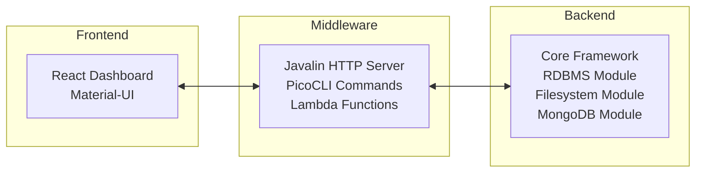

# QQQ - Low-Code Application Framework for Engineers

[](https://circleci.com/gh/Kingsrook/qqq)
[](https://central.sonatype.com/namespace/com.kingsrook.qqq)
[](https://adoptium.net/)
[](LICENSE.txt)

**QQQ** is a powerful, open source, metadata-driven application framework designed specifically for engineers who want to build business applications quickly without starting from scratch.

## 🚀 What Makes QQQ Different?

**QQQ gives you a complete foundation** - you define your data models, business logic, and UI through configuration and metadata, then QQQ handles the heavy lifting. No more boilerplate code, no more framework decisions, just rapid application development.

## 🔓 Open Source & Full Control

**QQQ is 100% open source** - you have complete ownership and control:

- **💻 Your Code**: Full access to QQQ's source code
- **🗄️ Your Data**: All data stays in your systems, never leaves your control
- **🏗️ Your System**: Deploy anywhere - on-premises, cloud, or hybrid
- **🔒 No Vendor Lock-in**: No SaaS subscriptions, no proprietary dependencies
- **⚡ Full Customization**: Modify, extend, and adapt QQQ to your exact needs
- **🌍 Community Driven**: Built by engineers, for engineers

**You own everything. You control everything. No surprises.**

### ✨ Core Capabilities

- **🔧 Data Management**: RDBMS, filesystem, MongoDB, SQLite support
- **⚡ Business Logic**: Actions, processes, automation, scheduled jobs  
- **🎨 User Interface**: React dashboard with Material-UI components
- **🌐 API Layer**: REST endpoints, CLI tools, Lambda functions
- **🔌 Extensibility**: Custom modules, widgets, and integrations

## 🏗️ Architecture

QQQ uses a **metadata-driven architecture** where everything is defined through configuration rather than code:



## 🚀 Quick Start

### Prerequisites
- **Java 17+** (required for QQQ features)
- **Maven 3.8+** (for build system)

### Build Locally
```bash
# Clone the repository
git clone git@github.com:Kingsrook/qqq.git
cd qqq

# Build everything
mvn clean install

# Run with sample project
mvn clean install -P withSample
```

### Use in Your Project
```xml
<dependency>
    <groupId>com.kingsrook.qqq</groupId>
    <artifactId>qqq-backend-core</artifactId>
    <version>0.27.0</version>
</dependency>

<!-- Add backend modules as needed -->
<dependency>
    <groupId>com.kingsrook.qqq</groupId>
    <artifactId>qqq-backend-module-rdbms</artifactId>
    <version>0.27.0</version>
</dependency>
```

## 📚 Documentation

**📖 [Complete Documentation Wiki](https://github.com/Kingsrook/qqq/wiki)** - Start here for comprehensive guides

- **[🏠 Home](https://github.com/Kingsrook/qqq/wiki/Home)** - Project overview and quick start
- **[🏗️ Architecture](https://github.com/Kingsrook/qqq/wiki/High-Level-Architecture)** - System design and principles
- **[🔧 Development](https://github.com/Kingsrook/qqq/wiki/Developer-Onboarding)** - Setup and contribution guide
- **[📦 Modules](https://github.com/Kingsrook/qqq/wiki/Core-Modules)** - Available components and usage
- **[🚀 Building](https://github.com/Kingsrook/qqq/wiki/Building-Locally)** - Local development workflow

## 🤝 Contributing

QQQ is **open source** and welcomes contributions! 

- **🐛 [Report Issues](https://github.com/Kingsrook/qqq/issues)** - Bug reports and feature requests
- **📝 [Contribution Guide](https://github.com/Kingsrook/qqq/wiki/Contribution-Guidelines)** - How to contribute code and documentation
- **🔍 [Code Standards](https://github.com/Kingsrook/qqq/wiki/Code-Review-Standards)** - QQQ's coding standards and review process

**First time contributing?** Start with our [Developer Onboarding Guide](https://github.com/Kingsrook/qqq/wiki/Developer-Onboarding) to get your environment set up.

## 🏢 About Kingsrook

QQQ is built by **[Kingsrook](https://qrun.io)** - making engineers more productive through intelligent automation and developer tools.

- **Website**: [https://qrun.io](https://qrun.io)
- **Contact**: [contact@kingsrook.com](mailto:contact@kingsrook.com)
- **GitHub**: [https://github.com/Kingsrook](https://github.com/Kingsrook)

## 📄 License

This project is licensed under the **GNU Affero General Public License v3.0** - see the [LICENSE.txt](LICENSE.txt) file for details.

---

**Ready to build faster with full control?** [Get started with QQQ today!](https://github.com/Kingsrook/qqq/wiki/Developer-Onboarding)
